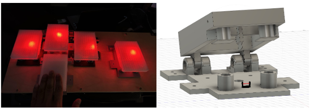
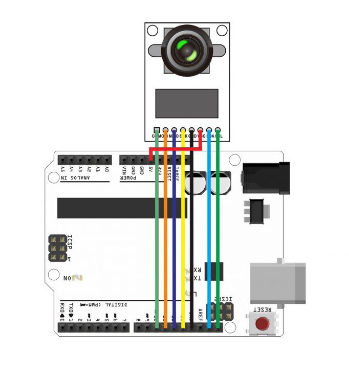

# ⚡ Electrical and Computer Engineering

## *️⃣ Motivation
Electrical and computer engineering appeals to me because it unites mathematics, physics, and hands-on design. I enjoy applying mathematical analysis to real engineering problems, whether in circuit design, embedded systems, or signal processing. My coursework and projects showed me how ideas move from theory into working systems, and I found that transition both challenging and rewarding. I am especially interested in hardware design, where abstract theory meets physical implementation. I enjoy creating schematics, laying out PCBs, and digging into the physics of components like semiconductors and optical devices. For me, the challenge is in bridging mathematical models with practical design choices to ensure that what works on paper translates into reliable, working systems. Ultimately, I am motivated by the chance to apply these skills productively by developing technologies that not only work, but also serve real needs and contribute meaningfully to society.

---

## 1️⃣ SALE (Smart Assisted Living Environment): Integrated IoT Solutions for Individuals with Limited Limb Mobility
With the growing need for independent living among people with disabilities and the elderly, smart homes offer a transformative solution through automation and remote control of daily household tasks. However, most existing systems lack inclusive designs that address the specific needs of users with impaired motor function. To bridge this gap, we developed a minimalist yet scalable smart home frame-work incorporating a custom adaptive remote control device that uses directional input to interact with various smart appliances. The system enables users to perform essential and semi-essential tasks such as lighting, entertainment, and door control, with minimal physical effort. My contributions include the remote control device interaction system and the smart security system.

 

 

 

### 🅰️ Remote Control Device Interaction System
The SALE-R (SALE Remote) buttons are designed to offer directional control to the resident, allowing them to navigate the smart home interface using up, down, left, right, and select commands. These buttons serve both assistive and rehabilitative purposes. While they enable the user to control the entire smart home system through the Smart Mobile Device, they also promote the use of residual limb mobility. Each time a button is physically pressed, the corresponding UI button in the bottom window of the Smart Mobile Device app lights up green. The primary circuitry of the system consists of a printed circuit board that detects button press signals, processes them, and sends them to the Smart Mobile Device using Bluetooth Low Energy (through the Pico W). The kick buttons were custom-designed and 3-D printed using Fusion360.

The core component is a transmissive photomicrosensor. Each button is equipped with one of these optical sensors, and the button mount includes a spring mechanism. When the button is pressed, an internal flag interrupts the laser beam inside the optical switch. This interruption signals the sensor that the button has been activated, thereby registering a button press.

 

 

 

### 💡 Optoelectronics Engineering

The EE-SX3173/4173-P series photomicrosensor achieves high precision and reliability by integrating an infrared LED emitter and a photo-integrated circuit (photo IC) in a single housing. The key to its advanced performance is the photo IC, which incorporates sophisticated signal processing directly on the detector chip rather than just relying on a simple phototransistor. The sensor uses a near-infrared LED, typically with a peak wavelength around 940 nm. Infrared light is less affected by ambient visible light, a common source of interference. A focusing lens is molded into the emitter side of the housing. This concentrates the emitted light into a narrow, parallel beam to ensure the light reaching the detector is not diffuse. A tight, focused beam is crucial for the precise detection of small objects or fine positioning as it provides a high-contrast change when interrupted.

The detector is a high-performance integrated circuit containing several components on a single chip. The photodiode is the primary sensing element, and is responsible for converting the incident infrared light into an electrical current through the photoelectric effect. The minuscule current generated by the photodiode is fed into a highly sensitive amplifier. This amplifies the signal to a level that can be reliably processed by the subsequent digital circuitry. The core of the signal processing is a built-in Schmitt trigger circuit. Unlike a simple phototransistor that provides a proportional analog current, the Schmitt trigger provides hysteresis. It has two distinct switching thresholds. The output switches ON only when the input light intensity surpasses a higher "turn-ON" threshold, and switches OFF only when it drops below a lower "turn-OFF" threshold. This hysteresis prevents the output from oscillating when the light level is near the switching point. This is critical for reliable detection, especially when an object moves slowly through the beam or when there is slight vibration. The output of the Schmitt trigger drives a final output stage, which provides the digital output signal. As an object enters the sensor's slot, it breaks the focused infrared light beam, causing the photodiode's output current to drop sharply. This causes the Schmitt trigger to cross its lower threshold and switch the output state. When the object exits, the light beam is restored, and the trigger crosses its upper threshold, reverting the output.

 

### 🅱️ Smart Security System
The goal of this device is to develop a smart security system capable of detecting motion at an entry point, capturing and processing image data, and securely communicating visual alerts via wireless protocols. The system is designed to function as a reliable and low-power video monitoring device for the smart home system. Emphasis is placed on reliable wireless communication and latency optimization for real-time streaming. The system is built around the following hardware and software elements. The ArduCAM Mini 5MP Plus (OV5642) is used to capture 320 x 240 JPEG images at 10 frames per second and compress them on board to reduce transmission burden. The Arduino UNO controls the ArduCAM and transmits JPEG image data line-by-line over UART. The Raspberry Pi Pico W reconstructs the JPEG and conditionally transmits the image via MQTT. The HC-SR501 PIR Motion Sensor is integrated with the Arduino to detect motion events. It triggers a notification on the Smart Mobile Device to prompt the user to open the live feed.

 

 

 

The ArduCAM Mini 5MP Plus (OV5642) is interfaced with the Arduino via SPI, using dedicated chip select, MISO, MOSI, and SCK lines. Upon motion detection using the HC-SR501 PIR sensor, the Arduino initiates continuous image capture in JPEG format at a resolution of 320 × 240. There is no fixed frame count limit; the Arduino continues to stream frames at a rate of approximately 10 frames per second for the duration of the motion event. Each frame is buffered internally by the ArduCAM and then read byte-by-byte over SPI. The Arduino transmits the JPEG data to the Pico via UART, enclosing each image between custom markers: IMG_START, frame_number, and END. These markers allow the Pico to detect and parse each complete image reliably, even if some markers are split across multiple Reads.

To ensure electrical compatibility between the two boards, a 2kΩ–1kΩ voltage divider is implemented on the Arduino TX line to safely shift its 5V UART signal to the Pico’s 3.3V logic level. The UART connection operates at a baud rate of 57600, which was experimentally determined to be the highest stable rate for full JPEG frame transfers without packet loss or corruption.

On the receiving end, the Pico W continuously reads from its UART buffer, monitoring for the IMG_START marker. Once this is detected, the Pico collects image data into a byte array until it sees the END marker. Afterward, it verifies the data by locating the standard JPEG start (0xFFD8) and end (0xFFD9) markers, and strips any garbage bytes before or after the actual image. The cleaned JPEG is then base64-encoded and published to the MQTT topic camera/frames/latest, where it can be rendered by Home Assistant or any other subscriber.

In parallel, the Arduino also transmits motion state messages (MOTION:1 or MOTION:0) when the PIR sensor is triggered or reset. These messages are processed by the Pico and published to the MQTT topic camera/motion, which allows the Home Assistant hub to distinguish between idle and active states, log motion events, and trigger user notifications. Because image capture is tied directly to the PIR signal and operates in real-time during motion, the system provides a continuously updated visual feed to the user while minimizing unnecessary image transmission during periods of inactivity. This implementation plan has been validated in testing and is robust under real-world usage.

 

  
  

 

System performance was evaluated in terms of image capture latency, transmission delay, and data consistency. With the ArduCAM configured to capture images at a reduced resolution of 320 x 240 pixels, average JPEG file sizes ranged between 8-15 KB depending on scene complexity. Simpler, low-texture scenes yielded smaller files and faster transmission times, while high-contrast or detailed scenes increased JPEG size and introduced transmission lag. The total end-to-end latency from image capture to image availability in Home Assistant was measured to be approximately 0.9 second under worst case conditions. The ArduCAM completes image capture in a consistent 100ms, while the remaining 800ms is split between UART transmission and Wi-Fi/MQTT publishing. Since image transfer over UART ac- counts for the bulk of this delay, the residual 200-400 ms was conservatively attributed to JPEG parsing, base64 encoding, MQTT transmission, broker processing, and Home Assistant rendering. While precise timing of each software layer was not instrumented, these estimates align with expected performance from similar MQTT-Wi-Fi pipelines. Transmission speed was strongly influenced by image complexity, as more detailed images required more bytes over UART and Wi-Fi. This resulted in latency variability of ±0.5 seconds. Below is an image showing how the video stream is displayed in home assistant.

 

 

 

## 2️⃣ Guitar Savior: Embedded Systems Project for Musical Video Game Entertainment System

## 3️⃣ Health Monitor: FPGA Medical Device
